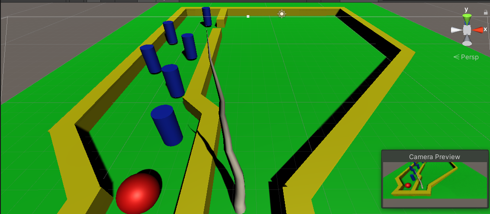
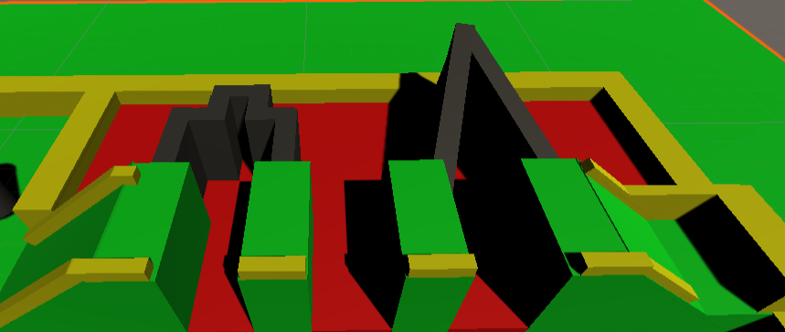

# RollingBall
Rolling ball in a maze. The main idea of the game is to get through the maze using WASD keys without hitting any of the obstacles in the course. Once an obstacle is hit, you restart the level automatically. Once the result position is reached, the scene can just transition to the doors scene from Ajay's part. The complexity is being increased to increase the duration of the game (multiple goal zones, moveing objects, harder obstacles)

## Features
1. The speed of the ball decreases every time you mess up, making it easier for you to finish the level.
2. Apart from just WASD, a jump movement has also been added to get through some specific obstacles.
3. Background music added, PPAP instrumental remix. 
4. Textual instructions at the start of the game need to be given. Movement details need to be given to explain how the game functions. 

#### 1. LavaRamp Area
Floor is a trigger with scripts added to relocate player to last checkpoint. In order to clear this area, the player can pass through the thin maze or jump over. User can't skip the stage by jumping to the sides, triggers/colliders are set to check for jumps.

