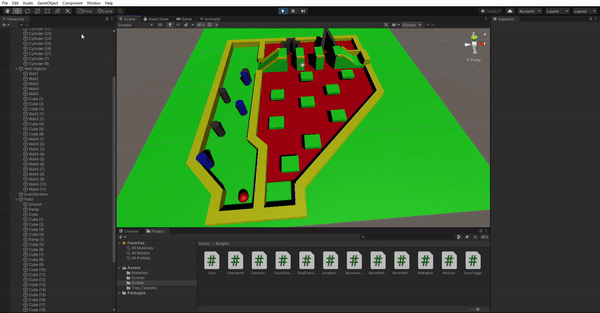

# RollingBall
  
Rolling ball in a maze. The main idea of the game is to get through the maze using WASD keys without hitting any of the obstacles in the course. Once an obstacle is hit, you restart the level automatically from the last checkpoint. Once the result position is reached, the scene can just transition out of this level.

## Major Stages

#### 1. Bin Area
Avoid the bins to reach the first checkpoint, constant movement added to the bins. You will reach the starting point if you hit any of the bins.

### 2. LavaRamp Area
Floor is a trigger with scripts added to relocate player to last checkpoint. In order to clear this area, the player can pass through the thin maze or jump over. User can't skip the stage by jumping to the sides, triggers/colliders are set to check for jumps.

### 3. "Floor is Lava" Area
Jump from platform to platform in order to reach the goal zone. Relocation to the last checkpoint in case of mess up.

